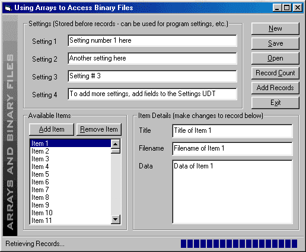



## Arrays and Binary File Access

### Description

This project demonstrates how to use a dynamic array to interact with database records and settings stored in a single binary file.

The example stores custom settings and the record count at the beginning of the binary file, then stores multiple database records. To retrieve the data, it gets the settings and record count, then loads the records into a dynamic array which can be interacted with on the form, much like a true database record. I needed a custom database format to store large, variable-length fields of data with a lot of symbol-type characters and still keep the packaged application smaller than 2Mb!

  

This code has been updated! I added a progress bar, streamlined the arrays (it's no longer using multidimensional arrays) and now it has progress bar support to show loading, saving and function progress. Any comments are welcome! I'm in the process of converting this project (with some major enhancements) to a class module to handle the routines. If you want to join this little project, post a message below. Depending on response, this may be developed into a complete flat-file database class (I'm getting tired of redistributing megabytes of DAO/ADO supports just to store a few dozen records). Don't forget to vote!
 
### More Info
 
This project was created in VB6 (SP5). I'm sure with very few modifications, it can be used in VB4&5.

This type of data access shouldn't be used for anything over 5,000 records or so. It just doesn't have the kind of performance (yet).

             |
---                |---
**Submitted On**   |2001-06-09 14:00:12
**By**             |[Jim Hunt](https://github.com/Planet-Source-Code/PSCIndex/blob/master/ByAuthor/jim-hunt.md)
**Level**          |Intermediate
**User Rating**    |4.6 (65 globes from 14 users)
**Compatibility**  |VB 4\.0 \(32\-bit\), VB 5\.0, VB 6\.0
**Category**       |[Data Structures](https://github.com/Planet-Source-Code/PSCIndex/blob/master/ByCategory/data-structures__1-33.md)
**World**          |[Visual Basic](https://github.com/Planet-Source-Code/PSCIndex/blob/master/ByWorld/visual-basic.md)
**Archive File**   |[Arrays and20890692001\.zip](https://github.com/Planet-Source-Code/jim-hunt-arrays-and-binary-file-access__1-23868/archive/master.zip)

